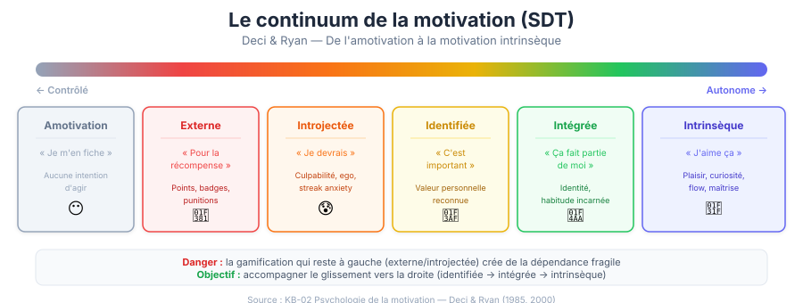

# 02 — Psychologie de la motivation

> Les théories fondamentales qui expliquent pourquoi les humains sont motivés — et comment les appliquer à la gamification.

---

## 1. Self-Determination Theory (SDT)

### Deci & Ryan (1985, 2000)

La SDT est probablement la théorie la plus importante pour la gamification. Elle identifie **trois besoins psychologiques fondamentaux** dont la satisfaction est nécessaire à la motivation intrinsèque :

### Les trois piliers

#### Autonomie (Autonomy)

> Le besoin de se sentir à l'origine de ses propres actions, de faire des choix significatifs.

| Favorise l'autonomie | Détruit l'autonomie |
|---|---|
| Choix du parcours d'apprentissage | Parcours linéaire obligatoire |
| Objectifs personnalisables | Objectifs imposés identiques pour tous |
| Rythme auto-déterminé | Deadlines rigides |
| Plusieurs chemins vers un badge | Un seul chemin possible |
| « Veux-tu continuer ? » | Redirection automatique forcée |

**En gamification** :
- Proposer plusieurs types de badges/quêtes
- Laisser l'utilisateur choisir ses objectifs
- Ne jamais forcer une mécanique (les streaks doivent être optionnels)
- Permettre la personnalisation (avatar, thème, notifications)

#### Compétence (Competence)

> Le besoin de se sentir efficace, de maîtriser son environnement, de progresser.

| Favorise la compétence | Détruit la compétence |
|---|---|
| Feedback immédiat et clair | Pas de feedback ou feedback retardé |
| Difficulté progressive | Difficulté plate ou incohérente |
| Progression visible (barres, niveaux) | Pas d'indicateur de progression |
| Célébration des accomplissements | Ignorer les réussites |
| Possibilité de réessayer | Échec définitif |

**En gamification** :
- Les barres de progression satisfont directement ce besoin
- Les badges valident la compétence acquise
- Les niveaux créent un sentiment de maîtrise croissante
- Le feedback immédiat (< 400ms) est critique

#### Relation sociale (Relatedness)

> Le besoin de se sentir connecté aux autres, d'appartenir à un groupe, de compter pour quelqu'un.

| Favorise la relation | Détruit la relation |
|---|---|
| Défis collaboratifs | Compétition uniquement |
| Partage d'accomplissements | Expérience solitaire |
| Mentorat et entraide | Classements humiliants |
| Communauté et forums | Isolement |
| Félicitations mutuelles | Comparaison forcée |

**En gamification** :
- Les guildes/équipes satisfont le besoin d'appartenance
- Le partage de badges crée du lien social
- Les leaderboards collaboratifs (équipe vs équipe) sont préférables aux classements individuels

### Le continuum de la motivation (SDT)



```
Motivation          Motivation extrinsèque                    Motivation
  nulle    ──────────────────────────────────────────────     intrinsèque
    │                                                              │
    ▼                                                              ▼
Amotivation → Régulation  → Régulation   → Régulation  → Régulation  → Motivation
               externe      introjectée    identifiée    intégrée      intrinsèque
    │            │              │              │              │              │
 "Je m'en    "Pour la       "Je devrais"   "C'est         "Ça fait      "J'aime
  fiche"     récompense"                    important"     partie        ça"
                                                           de moi"
```

**Le piège de la gamification** : Si la gamification repose uniquement sur des récompenses externes (points, badges), elle opère au niveau de la **régulation externe** — le niveau le plus faible de motivation extrinsèque. Le but est de faire évoluer l'utilisateur vers la **motivation intrinsèque**.

### L'effet de sur-justification (Overjustification Effect)

**Danger critique** : Ajouter des récompenses extrinsèques à une activité intrinsèquement motivante peut **réduire** la motivation intrinsèque.

Étude classique de Lepper, Greene & Nisbett (1973) :
- Des enfants qui aimaient dessiner ont été récompensés pour dessiner
- Quand les récompenses ont été retirées, ils dessinaient **moins** qu'avant l'expérience
- La récompense extrinsèque a « écrasé » la motivation intrinsèque

**Implication** : Ne gamifiez pas ce qui fonctionne déjà bien. Réservez la gamification aux comportements que vous souhaitez encourager et qui manquent de motivation naturelle.

---

## 2. La théorie du Flow (Csikszentmihalyi)

### Mihaly Csikszentmihalyi (1990)

Le flow est un état de concentration optimale où la personne est complètement absorbée par son activité.

### Les 8 conditions du flow

| # | Condition | Application gamification |
|---|-----------|--------------------------|
| 1 | **Objectifs clairs** | Quête avec description précise de ce qu'il faut faire |
| 2 | **Feedback immédiat** | Animation/son instantané à chaque action |
| 3 | **Équilibre défi/compétence** | Difficulté adaptive, niveaux progressifs |
| 4 | **Concentration profonde** | Interface épurée, pas de distraction |
| 5 | **Sentiment de contrôle** | L'utilisateur choisit ses actions |
| 6 | **Perte de conscience de soi** | Immersion, pas de rappel « tu es en train d'être gamifié » |
| 7 | **Distortion du temps** | Tellement engagé que le temps passe vite |
| 8 | **L'activité est sa propre récompense** | La gamification s'efface, l'activité devient plaisante en soi |

### Le canal du flow

```
Niveau de défi
     ▲
     │           ╱ ANXIÉTÉ
     │         ╱
     │       ╱  ┌─────────────┐
     │     ╱    │    FLOW     │
     │   ╱      │  (Zone      │
     │ ╱        │   optimale) │
     │╱         └─────────────┘
     │        ╱
     │      ╱  ENNUI
     │    ╱
     └──────────────────────▶
              Niveau de compétence
```

### L'escalade du flow

Pour maintenir le flow dans le temps, il faut augmenter **simultanément** le défi et la compétence :

```
Défi ▲
     │    ★ Niveau 5 (Expert)
     │   ╱
     │  ★ Niveau 4
     │ ╱
     │★ Niveau 3
     │╱
     ★ Niveau 2
    ╱│
   ★ │ Niveau 1 (Débutant)
     └────────────────▶ Compétence
```

Chaque niveau devrait :
1. Introduire une nouvelle compétence (pas juste « plus de la même chose »)
2. Être légèrement plus difficile que le précédent (+4% environ)
3. Valider la maîtrise du niveau précédent

---

## 3. La hiérarchie des besoins (Maslow revisité)

### Application à la gamification

Maslow a identifié une hiérarchie de besoins humains. Chaque niveau de la pyramide peut être satisfait par des mécaniques de gamification :

```
                    ╱╲
                   ╱  ╲
                  ╱Auto╲         Création de contenu, mentorat,
                 ╱réali-╲        objectifs personnels, mastery
                ╱sation  ╲
               ╱──────────╲
              ╱   Estime    ╲     Badges, leaderboards, titres,
             ╱   de soi      ╲    niveaux, reconnaissance
            ╱──────────────────╲
           ╱    Appartenance    ╲   Guildes, équipes, commentaires,
          ╱    et amour          ╲   partage, collaboration
         ╱────────────────────────╲
        ╱       Sécurité           ╲  Progression sauvegardée, streak
       ╱                            ╲  freeze, pas de perte définitive
      ╱──────────────────────────────╲
     ╱     Besoins physiologiques     ╲ UX de base : app qui fonctionne,
    ╱                                  ╲ pas de bugs, performance OK
   ╱────────────────────────────────────╲
```

**Point clé** : On ne peut pas satisfaire les besoins d'estime (badges) si les besoins de sécurité (pas de perte de données) ne sont pas satisfaits. L'UX de base doit être solide avant d'ajouter de la gamification.

---

## 4. Théorie de l'attribution (Weiner)

### Comment les gens expliquent leurs succès et échecs

Bernard Weiner a identifié trois dimensions d'attribution :

| Dimension | Interne | Externe |
|---|---|---|
| **Locus** | « J'ai réussi grâce à mes efforts » | « J'ai eu de la chance » |
| **Stabilité** | « Je suis intelligent » | « C'était un jour facile » |
| **Contrôlabilité** | « J'ai travaillé dur » | « L'examinateur était gentil » |

### Implication pour la gamification

La gamification doit renforcer les **attributions internes et contrôlables** :

| À faire | À éviter |
|---|---|
| « Tu as gagné ce badge grâce à ta persévérance » | « Badge obtenu ! » (sans explication) |
| « 7 jours consécutifs d'apprentissage » | « Streak bonus chanceux ! » |
| « Tu maîtrises maintenant les bases de X » | « Niveau suivant débloqué » (sans lien avec la compétence) |
| Montrer le chemin parcouru | Montrer uniquement le résultat |

L'idée est que l'utilisateur attribue son succès à **son propre effort** (et non à la chance ou au système), ce qui renforce la **motivation intrinsèque** et le **sentiment de compétence**.

---

## 5. La théorie de la fixation d'objectifs (Locke & Latham)

### Les 5 principes des objectifs efficaces

Edwin Locke et Gary Latham ont démontré que les objectifs influencent directement la performance :

| Principe | Description | Exemple gamification |
|---|---|---|
| **Clarté** | L'objectif doit être spécifique et mesurable | « Lire 5 articles cette semaine » (pas « lire plus ») |
| **Challenge** | L'objectif doit être ambitieux mais atteignable | Badge « Explorateur » = 20 articles (pas 2, pas 200) |
| **Engagement** | L'utilisateur doit adhérer à l'objectif | Laisser choisir ses objectifs, pas les imposer |
| **Feedback** | Progression régulière vers l'objectif | Barre de progression 3/5 articles |
| **Complexité** | Décomposer les objectifs complexes | Quête principale → sous-quêtes |

### Objectifs proximaux vs distaux

| Type | Caractéristique | Exemple | Effet |
|---|---|---|---|
| **Proximal** | Court terme, concret | « Complète 1 leçon aujourd'hui » | Motivation immédiate, feedback rapide |
| **Distal** | Long terme, ambitieux | « Obtiens le badge Master (100 leçons) » | Direction et sens, mais risque de découragement |

**Stratégie optimale** : Combiner les deux. Des objectifs distaux pour la direction, des objectifs proximaux pour le momentum quotidien.

### L'effet de la progression initiale (Endowed Progress Effect)

Nunes & Dreze (2006) — Étude de la carte de fidélité :
- **Groupe A** : Carte de 8 tampons (0/8 complétés)
- **Groupe B** : Carte de 10 tampons, 2 déjà tamponnés (2/10 complétés)
- **Résultat** : Même nombre d'actions requises (8), mais le Groupe B complétait 82% plus souvent

**Application** : Toujours donner un « head start » à l'utilisateur :
- Progression qui commence à 10%, pas 0%
- Premier badge offert gratuitement
- « Bienvenue ! Tu as déjà complété l'étape 1 en créant ton compte »

---

## 6. La théorie de l'autodétermination cognitive (CET)

### Sous-théorie de la SDT

La CET (Cognitive Evaluation Theory) explique comment les événements externes affectent la motivation intrinsèque :

### Deux aspects de chaque récompense

Toute récompense a un **aspect informatif** et un **aspect contrôlant** :

| Aspect | Effet sur la motivation intrinsèque | Exemple |
|---|---|---|
| **Informatif** | Augmente (feedback sur la compétence) | « Tu as maîtrisé la syntaxe JavaScript ! » |
| **Contrôlant** | Diminue (pression externe) | « Complète 3 leçons pour débloquer la suite » |

**Règle d'or** : Si l'aspect **informatif** domine → la motivation intrinsèque augmente. Si l'aspect **contrôlant** domine → elle diminue.

### Exemples pratiques

| Gamification informative ✅ | Gamification contrôlante ❌ |
|---|---|
| Badge qui valide une compétence acquise | Badge obligatoire pour accéder au contenu |
| « Tu progresses plus vite que la semaine dernière ! » | « Tu n'as pas atteint ton objectif quotidien » |
| Streak comme célébration de constance | Streak avec pénalité sévère de perte |
| Leaderboard optionnel et visible | Classement forcé avec shame board |

---

## 7. Théorie de l'évaluation cognitive sociale (Bandura)

### Auto-efficacité (Self-Efficacy)

Albert Bandura a montré que la croyance en sa propre capacité à réussir est le **prédicteur le plus fort de la performance réelle** :

#### Les 4 sources d'auto-efficacité

| Source | Description | Application gamification |
|---|---|---|
| **Expérience de maîtrise** | Avoir déjà réussi | Niveaux faciles au début, premiers badges rapides |
| **Expérience vicariante** | Voir d'autres réussir | « 1 247 personnes ont obtenu ce badge » |
| **Persuasion verbale** | Être encouragé | « Tu peux le faire ! Plus que 2 modules ! » |
| **État physiologique** | Se sentir en forme | Interface apaisante, pas de stress inutile |

### L'effet Pygmalion en gamification

Les attentes positives influencent la performance (Rosenthal & Jacobson, 1968) :
- Montrer que le système croit en l'utilisateur (« Basé sur ta progression, tu peux obtenir le badge Gold d'ici 2 semaines »)
- Présenter les défis comme atteignables
- Célébrer les progrès intermédiaires

---

## 8. Motivation intrinsèque vs extrinsèque

### Le spectre

```
EXTRINSÈQUE ◄─────────────────────────────────────────────► INTRINSÈQUE

Récompenses        Objectifs         Maîtrise et          Curiosité
externes           sociaux           compétence            pure
(points, prix)     (statut, groupe)  (devenir meilleur)    (plaisir d'apprendre)

FRAGILE ◄──────────────────────────────────────────────────► DURABLE
(arrête si la      (arrête si le                            (continue même
récompense         groupe change)                           sans récompense)
disparaît)
```

### Guide de décision

| Situation | Type de motivation à utiliser | Pourquoi |
|---|---|---|
| Démarrage / onboarding | **Extrinsèque** (badges, points) | L'utilisateur ne connaît pas encore la valeur intrinsèque |
| Habitude établie | **Transition** (réduire progressivement les récompenses) | L'activité commence à avoir de la valeur en soi |
| Utilisateur avancé | **Intrinsèque** (maîtrise, autonomie, sens) | L'activité est valorisée pour elle-même |

### La courbe de transition

```
Importance
de la
récompense    ██
extrinsèque   ████
              ██████
              ████████
              ██████████         Motivation
              ████████████       intrinsèque
              ██████████████         ▄▄
              ████████████████     ▄████
              ██████████████████ ▄██████
              ████████████████████████████
              └────────────────────────────▶
              Début    Habitude    Expert
```

---

## 9. Théorie du jeu (Game Theory) appliquée

### Dilemmes sociaux et coopération

La théorie des jeux éclaire les dynamiques sociales en gamification :

#### Le dilemme du prisonnier en gamification

| | Joueur B coopère | Joueur B triche |
|---|---|---|
| **Joueur A coopère** | Tous gagnent (3,3) | A perd, B gagne (0,5) |
| **Joueur A triche** | A gagne, B perd (5,0) | Tous perdent (1,1) |

**Implication** : Les systèmes de gamification doivent rendre la coopération plus rentable que la triche :
- Anti-triche robuste
- Récompenses de coopération supérieures aux récompenses de compétition
- Sanctions sociales pour les comporteurs antisociaux

### Jeux à somme nulle vs somme positive

| Somme nulle | Somme positive |
|---|---|
| Un gagnant = un perdant | Tout le monde peut gagner |
| Leaderboards classiques | Badges accessibles à tous |
| « Top 10 du mois » | « 500 personnes ont atteint le niveau 5 » |
| Crée de la frustration pour 90% | Crée de la satisfaction pour tous |

**Recommandation** : Privilégier les mécaniques à **somme positive** (tout le monde peut gagner) sauf pour les utilisateurs très compétitifs (qui doivent opter consciemment pour la compétition).

---

## 10. La dissonance cognitive (Festinger)

### Principe

Quand nos actions ne correspondent pas à nos croyances, nous ressentons un inconfort (dissonance) que nous cherchons à résoudre en modifiant nos croyances ou nos actions.

### Application en gamification

| Situation de dissonance | Résolution par l'utilisateur | Bénéfice |
|---|---|---|
| « J'ai déjà 15 badges » + « je ne suis pas du genre à lire » | « Finalement, je suis quelqu'un qui lit » | L'identité change |
| « J'ai un streak de 30 jours » + « je peux arrêter quand je veux » | « En fait, j'aime vraiment apprendre chaque jour » | L'habitude s'ancre |
| « J'ai investi 50h dans cette app » + « cette app est moyenne » | « Cette app est en fait très bien » | Fidélisation |

**Le piège** : La dissonance cognitive peut aussi être un outil de manipulation (sunk cost fallacy). Voir chapitre 09-Éthique.

---

## 11. L'adaptation hédonique (Hedonic Treadmill)

### Frederick & Loewenstein (1999)

L'adaptation hédonique est le phénomène par lequel nous revenons à un niveau de bonheur de base après un événement positif OU négatif :

```
Bonheur
    ▲
    │         ● Nouveau badge !
    │        ╱ ╲
    │       ╱   ╲───── Retour au baseline
    │      ╱        ╲
    │─────╱──────────╲──────── Baseline
    │                  ╲ ╱
    │                   ● Streak perdu
    └──────────────────────────▶ Temps
```

### Implications critiques pour la gamification

| Implication | Explication | Solution |
|---|---|---|
| **Les badges perdent leur impact** | Le 20e badge excite moins que le 1er | Varier les types, augmenter la rareté |
| **Les points deviennent banals** | 100 XP ne provoque plus rien après 10 000 XP | Introduire de nouvelles monnaies, multiplicateurs |
| **Les niveaux deviennent routine** | « Encore un level up, et alors ? » | Débloquer de VRAIES fonctionnalités à chaque niveau |
| **La compétition s'émousse** | Être #1 devient normal | Reset hebdomadaire, nouvelles catégories |

### Stratégies anti-adaptation

1. **Varier les récompenses** — Ne jamais donner la même chose deux fois de suite
2. **Espacer les pics** — Les grandes célébrations doivent être rares (confetti uniquement aux milestones)
3. **Introduire la nouveauté** — Nouvelles mécaniques débloquées progressivement
4. **Approfondir plutôt qu'élargir** — Des badges plus significatifs plutôt que plus nombreux
5. **Les récompenses sociales résistent mieux** — Un compliment d'un pair ne s'émousse pas aussi vite qu'un badge système

---

## 12. La théorie de la comparaison sociale (Festinger)

### Leon Festinger (1954)

Les humains évaluent leurs opinions et compétences en se comparant aux autres, surtout quand il n'y a pas de mesure objective.

### Deux directions de comparaison

| Direction | Description | Émotion | En gamification |
|---|---|---|---|
| **Ascendante** | Se comparer à quelqu'un de meilleur | Inspiration OU envie | Voir le leaderboard au-dessus de soi |
| **Descendante** | Se comparer à quelqu'un de moins bon | Fierté OU culpabilité | Voir le leaderboard en-dessous de soi |

### Application en gamification

**La comparaison ascendante** peut être inspirante (« je veux atteindre ce niveau ») ou toxique (« je n'y arriverai jamais ») selon deux facteurs :
- **Similarité perçue** : Si l'autre est « comme moi mais meilleur » → inspirant. Si « complètement hors de ma ligue » → démotivant.
- **Contrôlabilité** : Si l'écart est comblable par l'effort → motivant. Si dû à des avantages injustes → frustrant.

**Bonnes pratiques** :
- Leaderboards **relatifs** (±5 positions) plutôt que globaux
- Comparer avec des **similaires** (même date d'inscription, même objectif)
- Montrer le **progrès** plutôt que la position absolue (« +3 places cette semaine »)
- Offrir la possibilité de **masquer** le leaderboard

---

## 13. La réactance psychologique (Brehm)

### Jack Brehm (1966)

Quand on perçoit que notre liberté est menacée, on réagit en **faisant l'opposé** de ce qu'on nous demande.

### Quand la gamification provoque la réactance

| Situation | Réaction de réactance | Résultat |
|---|---|---|
| « Tu DOIS faire ta leçon quotidienne » | « Non, justement, je ne la ferai pas » | Abandon |
| Notification agressive à répétition | Désactiver les notifications | Perte de canal |
| Streak culpabilisant | Supprimer l'app par rébellion | Churn |
| Leaderboard forcé | Ressentiment, gaming du système | Comportement pervers |
| Partage social obligatoire | Refus catégorique | Frustration |

### Comment éviter la réactance

| Principe | Mauvais ❌ | Bon ✅ |
|---|---|---|
| **Choix** | « Complète le module » | « Quel module te tente ? » |
| **Opt-in** | Notifications activées par défaut | « Veux-tu être rappelé ? » |
| **Langage** | « Tu dois » | « Tu peux » |
| **Transparence** | Gamification invisible | « Voici comment fonctionne le système de badges » |
| **Exit** | Pas de moyen de désactiver | Bouton visible pour désactiver chaque mécanique |

**Règle** : Plus une mécanique de gamification est perçue comme une **contrainte**, plus elle provoque de la réactance. Elle doit toujours être perçue comme une **opportunité**.

---

## 14. Le design émotionnel (Donald Norman)

### Les 3 niveaux de design émotionnel

Donald Norman (*Emotional Design*, 2004) identifie 3 niveaux de traitement émotionnel :

```
                    ┌────────────────┐
                    │   RÉFLEXIF     │ ← Sens, identité, valeurs
                    │ (Qui je suis)  │   "Je suis le genre de personne
                    │                │    qui a 15 badges"
                    └───────┬────────┘
                    ┌───────┴────────┐
                    │ COMPORTEMENTAL │ ← Usage, plaisir d'utilisation
                    │ (Ce que je fais)│   "C'est satisfaisant de voir
                    │                │    la barre progresser"
                    └───────┬────────┘
                    ┌───────┴────────┐
                    │   VISCÉRAL     │ ← Réaction instinctive, esthétique
                    │ (Ce que je     │   "Waouh, cette animation
                    │  ressens)      │    de confetti est belle !"
                    └────────────────┘
```

### Application à la gamification

| Niveau | Ce qui se joue | Exemples gamification |
|---|---|---|
| **Viscéral** | Première impression, beauté, plaisir sensoriel | Animation de badge, confetti, son satisfaisant, couleurs vives |
| **Comportemental** | Facilité d'utilisation, plaisir fonctionnel | Feedback immédiat, progression fluide, interface intuitive |
| **Réflexif** | Sens, fierté, identité, histoire personnelle | « Je suis un Expert », partage de badge, année en review |

**Le niveau réflexif est le plus durable** : c'est celui qui change l'identité de l'utilisateur. Le viscéral attire, le comportemental retient, le réflexif fidélise.

---

## 15. La charge cognitive (Cognitive Load Theory)

### John Sweller (1988)

Le cerveau a une capacité limitée de traitement d'information (mémoire de travail : 7 ± 2 éléments).

### Les 3 types de charge cognitive

| Type | Description | Implication gamification |
|---|---|---|
| **Intrinsèque** | Complexité du contenu lui-même | Un système de gamification complexe surcharge |
| **Extrinsèque** | Mauvaise présentation | Trop d'éléments visuels gamification à l'écran |
| **Germane** | Effort de construction du savoir | La gamification doit AIDER le traitement, pas le gêner |

### Règles pour la gamification

| Règle | Explication | Application |
|---|---|---|
| **Pas plus de 3-4 métriques visibles** | Mémoire de travail limitée | Streak + XP + prochain badge. Pas 10 compteurs. |
| **Progressive disclosure** | Révéler les mécaniques une par une | Pas de dashboard complet au jour 1 |
| **Chunking** | Grouper les infos en blocs | Catégories de badges plutôt que liste plate |
| **Signalement** | Mettre en évidence ce qui est important | La prochaine action est toujours claire |
| **Pas de gamification pendant le contenu** | La gamification ne doit pas distraire de la tâche | Toast APRÈS avoir fini de lire, pas pendant |

---

## 16. Le temporal discounting (Escompte temporel)

### Le biais du présent

Les humains préfèrent une récompense immédiate à une récompense future plus grande. C'est biologiquement câblé.

```
Valeur perçue
    ▲
    │ ●  Récompense immédiate (10 XP maintenant)
    │  ╲
    │    ╲
    │      ╲
    │        ╲────── Récompense différée (100 XP dans 1 mois)
    │
    └────────────────────────────▶ Temps
```

### Implications pour la gamification

| Problème | Solution |
|---|---|
| « Pourquoi travailler pour un badge dans 3 semaines ? » | Récompenses immédiates (XP) + récompenses différées (badges) |
| L'objectif lointain ne motive pas | Sous-objectifs quotidiens avec micro-récompenses |
| Le premier badge est trop loin | Premier badge en < 2 minutes |
| Le niveau suivant prend trop de temps | Barre de progression visible à tout moment |

**Le principe de la double récompense** : Chaque action devrait donner une récompense immédiate (petite) ET contribuer à une récompense future (grande). L'utilisateur obtient une gratification instantanée tout en progressant vers un objectif long terme.

---

## 17. Les intentions d'implémentation (Gollwitzer)

### Peter Gollwitzer (1999)

Les « implementation intentions » sont des plans « si-alors » qui augmentent drastiquement la probabilité d'action :

> « SI [situation], ALORS [action] »

Méta-analyse de Gollwitzer & Sheeran (2006) : les intentions d'implémentation augmentent la probabilité d'action de **d = 0.65** (effet moyen-fort).

### Application en gamification

| Fonctionnalité | Intention d'implémentation |
|---|---|
| **Rappel configurable** | « Je veux être rappelé à [HEURE] pour lire mon article » |
| **Planification de session** | « Chaque [JOUR], je consacre [DURÉE] à l'apprentissage » |
| **Si-alors automatisé** | « Si je n'ai pas lu d'article à 20h, envoie-moi un rappel » |
| **Goal setting** | « Cette semaine, je vais lire [N] articles dans [CATÉGORIE] » |

Le streak est une intention d'implémentation implicite : « Chaque jour, je fais au moins une action ».

---

## 18. Résumé étendu : les piliers psychologiques de la gamification efficace

| # | Pilier | Théorie | Actionnable |
|---|--------|---------|-------------|
| 1 | **Autonomie** | SDT | Donner des choix, ne rien imposer |
| 2 | **Compétence** | SDT + Bandura | Feedback immédiat, progression visible |
| 3 | **Relation** | SDT | Social, collaboration, communauté |
| 4 | **Flow** | Csikszentmihalyi | Défi ≈ compétence, feedback rapide |
| 5 | **Objectifs clairs** | Locke & Latham | SMART, proximaux + distaux |
| 6 | **Progression initiale** | Endowed Progress | Commencer à 10%, pas 0% |
| 7 | **Attribution interne** | Weiner | Lier le succès à l'effort, pas au système |
| 8 | **Auto-efficacité** | Bandura | Premiers succès rapides, modèles de réussite |
| 9 | **Information > Contrôle** | CET | Récompenses informatives, pas contrôlantes |
| 10 | **Transition intrinsèque** | SDT | Réduire les récompenses externes avec le temps |
| 11 | **Anti-adaptation** | Hedonic Treadmill | Varier les récompenses, espacer les pics |
| 12 | **Comparaison sociale saine** | Festinger | Comparaison avec des similaires, progrès relatif |
| 13 | **Respecter la liberté** | Réactance (Brehm) | Jamais de « tu dois », toujours « tu peux » |
| 14 | **Design émotionnel** | Norman | Viscéral (beau) + Comportemental (facile) + Réflexif (identité) |
| 15 | **Charge cognitive minimale** | Sweller | Max 3-4 métriques visibles, progressive disclosure |
| 16 | **Gratification immédiate** | Temporal Discounting | Double récompense : micro maintenant + macro plus tard |
| 17 | **Planification si-alors** | Gollwitzer | Aider l'utilisateur à planifier ses sessions |

---

## Lectures recommandées

- **Deci, E. & Ryan, R.** — *Intrinsic Motivation and Self-Determination in Human Behavior* (1985)
- **Csikszentmihalyi, M.** — *Flow: The Psychology of Optimal Experience* (1990)
- **Bandura, A.** — *Self-Efficacy: The Exercise of Control* (1997)
- **Locke, E. & Latham, G.** — *A Theory of Goal Setting and Task Performance* (1990)
- **Pink, D.** — *Drive: The Surprising Truth About What Motivates Us* (2009)
- **Kahneman, D.** — *Thinking, Fast and Slow* (2011)
- **Duhigg, C.** — *The Power of Habit* (2012)
- **Norman, D.** — *Emotional Design: Why We Love (or Hate) Everyday Things* (2004)
- **Brehm, J.** — *A Theory of Psychological Reactance* (1966)
- **Festinger, L.** — *A Theory of Social Comparison Processes* (1954)
- **Sweller, J.** — *Cognitive Load During Problem Solving* (1988)
- **Gollwitzer, P.** — *Implementation Intentions: Strong Effects of Simple Plans* (1999)
- **Frederick, S. & Loewenstein, G.** — *Hedonic Adaptation* (1999)
- **Clear, J.** — *Atomic Habits* (2018) — excellente vulgarisation
