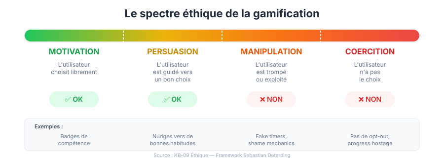

# 09 — Éthique et dark patterns de la gamification

> Concevoir une gamification responsable qui respecte les utilisateurs et évite la manipulation.

---

## 1. Le spectre éthique de la gamification

### De la motivation à la manipulation



```
MOTIVATION          PERSUASION         MANIPULATION        COERCITION
    │                   │                   │                   │
    ▼                   ▼                   ▼                   ▼
L'utilisateur      L'utilisateur      L'utilisateur       L'utilisateur
choisit            est guidé           est trompé          n'a pas le
librement          vers un bon         ou exploité         choix
                   choix
    │                   │                   │                   │
    ▼                   ▼                   ▼                   ▼
   ✅ OK              ✅ OK              ❌ NON              ❌ NON
```

### Le test de l'intention

Pour chaque mécanique de gamification, posez-vous ces 3 questions :

1. **Est-ce que cette mécanique sert l'utilisateur ou uniquement le business ?**
2. **Est-ce que l'utilisateur serait d'accord s'il comprenait le mécanisme ?**
3. **Est-ce que je serais à l'aise si un journaliste écrivait un article sur cette mécanique ?**

Si la réponse à l'une de ces questions est « non », reconsidérez la mécanique.

### Le framework éthique de Sebastian Deterding

Deterding propose 3 niveaux de questionnement :

| Niveau | Question | Exemple |
|---|---|---|
| **Conséquences** | Quels effets cette mécanique produit-elle ? | Le streak cause-t-il de l'anxiété ? |
| **Vertus** | Cette mécanique développe-t-elle de bonnes qualités ? | La progression encourage-t-elle la persévérance ? |
| **Droits** | Les droits de l'utilisateur sont-ils respectés ? | L'utilisateur peut-il opt-out ? |

---

## 2. Dark patterns de gamification

### Catalogue des dark patterns

#### 2.1 Shame Mechanics (Mécanique de la honte)

**Description** : Utiliser la culpabilité ou la honte pour manipuler le comportement.

| Pattern | Exemple | Pourquoi c'est un dark pattern |
|---|---|---|
| **Streak guilt** | « Tu vas perdre ton streak de 47 jours ! » (ton agressif) | Exploite l'anxiété |
| **Social shame** | « Tous tes amis ont fait leur leçon sauf toi » | Pression sociale négative |
| **Sad mascot** | Le hibou Duolingo triste/pleurant | Manipulation émotionnelle |
| **Public failure** | Afficher les derniers du classement | Humiliation publique |
| **Comparative shame** | « Tu es 85% moins actif que la moyenne » | Dévalorisation |

**Alternative éthique** :
- « Super, tu reviens ! Continue où tu t'étais arrêté »
- « Ton ami a obtenu un badge — pourquoi pas toi ? » (positif, pas honteux)
- Masquer les dernières positions du leaderboard

#### 2.2 Artificial Scarcity (Rareté artificielle)

**Description** : Créer une fausse urgence ou rareté pour forcer l'action.

| Pattern | Exemple | Pourquoi c'est un dark pattern |
|---|---|---|
| **Fake timer** | « Plus que 2h ! » (qui se reset en boucle) | Mensonge |
| **Artificial limits** | 3 vies par jour (pour vendre des vies) | Paywall déguisé |
| **False exclusivity** | « Seulement 100 places ! » (en réalité illimité) | Tromperie |
| **FOMO manipulation** | « 247 personnes regardent ça ! » (chiffre gonflé) | Pression artificielle |

**Alternative éthique** :
- Timers réels avec raison légitime
- Limites liées au bien-être (« Prends une pause, reviens demain »)
- Exclusivité réelle et transparente

#### 2.3 Sunk Cost Exploitation (Exploitation du coût irrécupérable)

**Description** : Rendre le départ trop « coûteux » en termes d'investissement passé.

| Pattern | Exemple | Pourquoi c'est un dark pattern |
|---|---|---|
| **Progress hostage** | « Si tu annules, tu perds tout ton progrès » | Rétention par menace |
| **Investment lock-in** | 500h de jeu = impossible de quitter émotionnellement | Addiction par sunk cost |
| **Deletion guilt** | « Tu vas perdre 2 347 badges si tu supprimes ton compte » | Manipulation émotionnelle |

**Alternative éthique** :
- Export de données facile
- « Tu peux revenir quand tu veux, ton progrès sera là »
- Pas de suppression de données punitive

#### 2.4 Pay-to-Win et paywalls gamifiés

**Description** : Créer un avantage injuste pour ceux qui paient.

| Pattern | Exemple | Pourquoi c'est un dark pattern |
|---|---|---|
| **Pay-to-win leaderboard** | Les payants dominent les classements | Injuste |
| **Gamified paywall** | « Plus que 3 articles gratuits ! (barre à 90%) » | Manipulation du biais de complétion |
| **Predatory loot boxes** | Loot boxes payantes avec taux de drop manipulés | Gambling déguisé |
| **Energy monetization** | Vies/énergie limites → payer pour continuer | Exploitation de l'impatience |

**Alternative éthique** :
- Cosmétiques payants uniquement (pas d'avantage fonctionnel)
- Pas de loot boxes payantes
- Modèle d'abonnement transparent

#### 2.5 Notification Manipulation

**Description** : Abuser des notifications pour forcer le retour.

| Pattern | Exemple | Pourquoi c'est un dark pattern |
|---|---|---|
| **Fear notifications** | « TON STREAK VA ÊTRE PERDU ! » | Anxiété |
| **Fake social** | « Quelqu'un a mentionné... » (pas vrai) | Mensonge |
| **Timing exploitation** | Notifications à 23h55 (fin de streak) | Exploitation du sommeil |
| **Notification overload** | 10+ notifications gamification / jour | Spam, désinstallation |
| **Dark opt-out** | Notifications activées par défaut, difficiles à désactiver | Violation du consentement |

**Alternative éthique** :
- Opt-in pour toutes les notifications
- Maximum 1-2 notifications gamification par jour
- Ton positif et encourageant (pas anxiogène)
- Respect des heures de repos (pas après 21h)
- Désactivation facile et accessible

#### 2.6 Manipulation des enfants

**Description** : Exploiter la vulnérabilité cognitive des enfants.

Les enfants sont particulièrement vulnérables à la gamification car :
- **Cortex préfrontal non mature** (jusqu'à 25 ans) → moins de contrôle des impulsions
- **Sensibilité dopaminergique élevée** → plus réactifs aux récompenses
- **Difficulté à distinguer jeu et manipulation** → moins de recul critique
- **Pression sociale amplifiée** → plus sensibles aux comparaisons

**Règles éthiques pour les enfants** :
- ❌ Aucune loot box ou récompense payante
- ❌ Aucune pression temporelle agressive
- ❌ Aucun leaderboard comparatif
- ❌ Aucune notification de culpabilisation
- ✅ Gamification éducative uniquement
- ✅ Limites de temps d'écran intégrées
- ✅ Consentement parental requis
- ✅ Récompenses informatives (« Tu as appris X ! »)

---

## 3. Principes de gamification éthique

### Le manifeste de la gamification responsable

#### 1. Transparence

```
L'utilisateur doit savoir :
- Que le produit utilise de la gamification
- Comment fonctionnent les mécaniques (pas de boîte noire)
- Comment ses données sont utilisées
- Comment opt-out de chaque mécanique
```

#### 2. Consentement

```
L'utilisateur doit pouvoir :
- Désactiver les notifications de gamification
- Masquer les streaks, badges, leaderboards
- Supprimer son compte sans pénalité émotionnelle
- Exporter ses données
- Choisir son niveau de gamification (aucun / léger / complet)
```

#### 3. Bien-être

```
La gamification doit :
- Servir les objectifs de l'utilisateur, pas uniquement les métriques business
- Ne pas créer de dépendance intentionnelle
- Respecter le sommeil (pas de notifications nocturnes)
- Encourager les pauses (pas les sessions infinies)
- Ne pas culpabiliser en cas d'absence
```

#### 4. Équité

```
La gamification doit :
- Être accessible à tous (pas de pay-to-win)
- Ne pas discriminer les utilisateurs à faible engagement
- Offrir des chemins multiples (pas un seul way to win)
- Ne pas exploiter les vulnérabilités psychologiques
```

#### 5. Authenticité

```
La gamification doit :
- Lier les récompenses à des accomplissements réels
- Ne pas utiliser de chiffres gonflés ou de faux indicateurs
- Ne pas créer de fausse urgence ou rareté
- Refléter la progression réelle, pas une illusion
```

---

## 4. Framework ETHICAL pour la gamification

| Lettre | Principe | Question à se poser |
|---|---|---|
| **E** | Empowerment | Cette mécanique donne-t-elle du pouvoir à l'utilisateur ? |
| **T** | Transparency | L'utilisateur comprend-il comment ça fonctionne ? |
| **H** | Honesty | Est-ce que c'est honnête ? Pas de faux chiffres ? |
| **I** | Informed consent | L'utilisateur a-t-il choisi en connaissance de cause ? |
| **C** | Control | L'utilisateur peut-il opt-out facilement ? |
| **A** | Accessibility | C'est accessible à tous, pas juste aux payants ? |
| **L** | Long-term wellbeing | Ça sert le bien-être long terme, pas juste les métriques ? |

---

## 5. Le dilemme des streaks

### Le cas du streak : bien ou mal ?

Le streak est la mécanique de gamification la plus efficace ET la plus éthiquement controversée :

#### Arguments POUR le streak

| Argument | Explication |
|---|---|
| **Crée des habitudes** | La répétition quotidienne crée des habitudes durables |
| **Motivant** | Voir son compteur monter est gratifiant |
| **Simple** | Mécanisme compréhensible par tous |
| **Prouvé** | Impact mesuré sur la rétention (+14-21% chez Duolingo) |
| **Identité** | « J'ai un streak de 100 jours » = fierté |

#### Arguments CONTRE le streak

| Argument | Explication |
|---|---|
| **Anxiété** | La peur de perdre le streak crée du stress quotidien |
| **Culpabilité** | Les jours manqués = sentiment de culpabilité |
| **Abandon brutal** | La perte d'un long streak → abandon complet (50% churn) |
| **Corvée** | L'activité devient une obligation, pas un plaisir |
| **Inégalité** | Les gens malades, en vacances, etc. sont pénalisés |

### Le streak éthique : best practices

```
✅ Streak avec grace period (1 jour d'absence autorisé)
✅ Streak freeze (protection achetable ou gagnée)
✅ Streak recovery (restaurer un streak récent)
✅ Notifications positives (« Tu es sur une lancée ! » pas « Tu vas perdre ! »)
✅ Opt-out du streak (masquer si l'utilisateur ne veut pas)
✅ Célébration des milestones sans pression les autres jours
✅ « Streak longest » préservé même si le streak actuel reset

❌ Notifications anxiogènes (« Tu vas PERDRE ton streak ! »)
❌ Reset total sans filet de sécurité
❌ Streak obligatoire pour progresser
❌ Message triste/culpabilisant après perte
❌ Notifications à 23h55
```

---

## 6. RGPD et réglementation

### Données de gamification et RGPD

Les données de gamification sont des **données personnelles** au sens du RGPD :

| Donnée | Classification | Base légale |
|---|---|---|
| **Score/points** | Donnée personnelle | Consentement ou intérêt légitime |
| **Badges obtenus** | Donnée personnelle | Consentement ou intérêt légitime |
| **Streak history** | Donnée personnelle | Consentement ou intérêt légitime |
| **Position leaderboard** | Donnée personnelle (visible) | Consentement explicite |
| **Profiling par type de joueur** | Donnée sensible (profiling) | Consentement explicite |
| **Données comportementales** | Donnée personnelle | Consentement explicite |

### Obligations RGPD

| Obligation | Application gamification |
|---|---|
| **Droit d'accès** | L'utilisateur peut voir toutes ses données gamification |
| **Droit de rectification** | L'utilisateur peut corriger ses données |
| **Droit à l'oubli** | L'utilisateur peut demander la suppression complète |
| **Droit à la portabilité** | Export des badges, streaks, scores en format lisible |
| **Droit d'opposition** | L'utilisateur peut refuser la gamification |
| **Minimisation** | Ne collecter que les données nécessaires |
| **Privacy by design** | Intégrer la privacy dès la conception |

### Loot boxes et réglementation

| Pays | Statut des loot boxes | Règle |
|---|---|---|
| **Belgique** | Illégales | Considérées comme jeu d'argent |
| **Pays-Bas** | Illégales | Considérées comme jeu d'argent |
| **Chine** | Réglementées | Obligation de publier les taux de drop |
| **Japon** | Partiellement réglementées | « Kompu gacha » interdit |
| **USA** | Pas réglementées | Mais débats en cours |
| **UE** | En discussion | Directive en préparation |

---

## 7. Gamification et santé mentale

### Risques identifiés

| Risque | Description | Population à risque |
|---|---|---|
| **Addiction comportementale** | Incapacité à arrêter malgré les conséquences | Adolescents, personnes à tendance addictive |
| **Anxiété de performance** | Stress lié aux objectifs, streaks, classements | Perfectionnistes, anxieux |
| **FOMO chronique** | Anxiété de manquer les événements/récompenses | Utilisateurs hyperconnectés |
| **Baisse d'estime de soi** | Comparaison sociale négative via leaderboards | Personnes en situation de vulnérabilité |
| **Culpabilité** | Sentiment de culpabilité pour les jours manqués | Utilisateurs consciencieux |
| **Burnout gamification** | Épuisement par surexposition aux mécaniques | Utilisateurs long-terme |

### Signaux d'alarme

```
🔴 L'utilisateur utilise le produit > 4h/jour à cause de la gamification
🔴 L'utilisateur exprime de l'anxiété liée au streak/classement
🔴 L'utilisateur fait des actions uniquement pour les points (pas de valeur)
🔴 L'utilisateur se réveille la nuit pour maintenir son streak
🔴 L'utilisateur sacrifie des activités importantes pour la gamification
```

### Mesures de protection

| Mesure | Description | Implémentation |
|---|---|---|
| **Limites de temps** | Rappel après X heures d'utilisation | « Tu utilises l'app depuis 2h. Prends une pause ? » |
| **Mode zen** | Désactiver toute gamification | Toggle on/off dans les paramètres |
| **Streak compassionnel** | Grace period automatique | 1 jour d'absence ne casse pas le streak |
| **Leaderboard opt-out** | Masquer son classement | Option dans le profil |
| **Notifications responsables** | Limiter la fréquence et le ton | Max 2/jour, ton positif |
| **Digital wellbeing** | Rapport d'utilisation | Combien de temps par jour/semaine |

---

## 8. Le Persuasive Design Ethics Canvas

### Canvas pour évaluer l'éthique d'une mécanique

```
┌──────────────────────────────────────────────────┐
│  MÉCANIQUE : [nom de la mécanique]               │
│                                                  │
│  ┌─────────────────┐  ┌────────────────────────┐ │
│  │ INTENTION       │  │ IMPACT UTILISATEUR     │ │
│  │                 │  │                        │ │
│  │ Pourquoi cette  │  │ Quel effet réel sur    │ │
│  │ mécanique ?     │  │ l'utilisateur ?        │ │
│  │                 │  │                        │ │
│  │ ☐ Aide l'user   │  │ ☐ Positif             │ │
│  │ ☐ Aide le biz   │  │ ☐ Neutre              │ │
│  │ ☐ Les deux      │  │ ☐ Négatif potentiel   │ │
│  └─────────────────┘  └────────────────────────┘ │
│                                                  │
│  ┌─────────────────┐  ┌────────────────────────┐ │
│  │ TRANSPARENCE    │  │ CONTRÔLE               │ │
│  │                 │  │                        │ │
│  │ L'user sait     │  │ L'user peut            │ │
│  │ comment ça      │  │ opt-out ?              │ │
│  │ fonctionne ?    │  │                        │ │
│  │                 │  │ ☐ Oui, facilement      │ │
│  │ ☐ Oui           │  │ ☐ Oui, difficilement  │ │
│  │ ☐ Partiellement │  │ ☐ Non                  │ │
│  │ ☐ Non           │  │                        │ │
│  └─────────────────┘  └────────────────────────┘ │
│                                                  │
│  ┌─────────────────────────────────────────────┐ │
│  │ VERDICT                                     │ │
│  │                                             │ │
│  │ ☐ ✅ Éthique — Implémenter                  │ │
│  │ ☐ ⚠️ Attention — Implémenter avec garde-fous│ │
│  │ ☐ ❌ Dark pattern — Ne pas implémenter       │ │
│  └─────────────────────────────────────────────┘ │
└──────────────────────────────────────────────────┘
```

---

## 9. Checklist éthique pré-lancement

Avant de lancer une fonctionnalité gamifiée, validez chaque point :

### Transparence
- [ ] L'utilisateur sait qu'il y a de la gamification
- [ ] Les règles sont expliquées clairement
- [ ] Les algorithmes ne sont pas opaques

### Consentement
- [ ] Les notifications sont opt-in
- [ ] Le leaderboard est opt-in
- [ ] L'utilisateur peut désactiver chaque mécanique individuellement
- [ ] Le streak peut être masqué

### Bien-être
- [ ] Pas de notification après 21h
- [ ] Pas de message culpabilisant
- [ ] Grace period sur les streaks
- [ ] Rappel de pause après 2h d'utilisation
- [ ] Le ton est toujours encourageant, jamais punitif

### Équité
- [ ] Pas de pay-to-win sur les classements
- [ ] Les badges sont accessibles sans payer
- [ ] Pas de discrimination basée sur le niveau d'engagement
- [ ] Accessibilité (a11y) pour toutes les mécaniques

### Données
- [ ] RGPD compliant
- [ ] Export de données possible
- [ ] Droit à l'oubli implémenté
- [ ] Données de gamification minimisées

### Populations vulnérables
- [ ] Les enfants (< 16 ans) ont des protections supplémentaires
- [ ] Pas de loot boxes payantes
- [ ] Limites de dépenses si monnaie virtuelle payante
- [ ] Pas de ciblage des utilisateurs identifiés comme vulnérables

---

## 10. La gamification au service du bien

### Exemples de gamification éthique et positive

| Produit | Cause | Mécanique |
|---|---|---|
| **Recyclebank** | Recyclage | Points pour le recyclage → récompenses locales |
| **Charity Miles** | Charité | Km parcourus → dons à des associations |
| **Forest** | Concentration | Arbre qui pousse pendant le focus (meurt si distrait) |
| **Habitica** | Productivité | RPG qui rend les tâches quotidiennes fun |
| **Zombies, Run!** | Fitness | Course gamifiée avec narrative zombie |
| **Foldit** | Science | Puzzle game qui aide la recherche en protéines |
| **Duolingo** | Éducation | Apprentissage de langues gratuit et gamifié |

### Le « Meaningful Gamification » (Nicholson)

Scott Nicholson propose une gamification centrée sur le sens plutôt que les récompenses :

| Principe | Description | Exemple |
|---|---|---|
| **Play** | Laisser l'utilisateur jouer librement | Exploration sans contrainte |
| **Exposition** | Montrer l'information de façon engageante | Visualisation de données personnelles |
| **Choice** | Offrir des choix significatifs | Choisir son parcours |
| **Information** | Fournir de l'information pertinente | Feedback qualitatif, pas juste des points |
| **Engagement** | Créer de l'engagement authentique | Communauté, mentorat |
| **Reflection** | Encourager la réflexion | Récapitulatifs significatifs |

---

## Résumé : les 10 commandements de la gamification éthique

| # | Commandement |
|---|---|
| 1 | **Tu ne manipuleras point** — Motivation, pas manipulation |
| 2 | **Tu seras transparent** — L'utilisateur sait comment ça marche |
| 3 | **Tu respecteras le consentement** — Opt-in, pas opt-out |
| 4 | **Tu ne culpabiliseras point** — Encourager, jamais punir |
| 5 | **Tu protégeras les vulnérables** — Enfants, personnes à risque |
| 6 | **Tu respecteras le sommeil** — Pas de notifications nocturnes |
| 7 | **Tu permettras l'opt-out** — Chaque mécanique peut être désactivée |
| 8 | **Tu ne paieras pas pour gagner** — Pas de pay-to-win |
| 9 | **Tu respecteras les données** — RGPD, minimisation, portabilité |
| 10 | **Tu serviras l'utilisateur** — Sa progression, pas tes métriques |

---

## Lectures recommandées

- **Deterding, S.** — *The Ambiguity of Games: Histories and Frameworks* (2014)
- **Bogost, I.** — *Persuasive Games: The Expressive Power of Videogames* (2007) / *Gamification is Bullshit* (2011)
- **Nicholson, S.** — *A RECIPE for Meaningful Gamification* (2015)
- **Zuboff, S.** — *The Age of Surveillance Capitalism* (2019)
- **Harris, T.** — *Center for Humane Technology* — articles et conférences
- **GDPR** — Règlement Général sur la Protection des Données (texte officiel)
